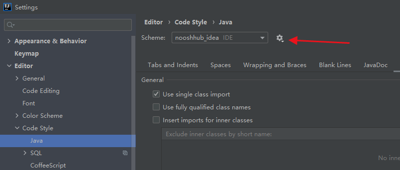

#### go ahead send us an issue to ask anything or PR to main branch.

### develop
#### set up
1. please add this to your maven settings.xml
```xml
<?xml version="1.0" encoding="UTF-8"?>
<settings xmlns="http://maven.apache.org/SETTINGS/1.0.0"
          xmlns:xsi="http://www.w3.org/2001/XMLSchema-instance"
          xsi:schemaLocation="http://maven.apache.org/SETTINGS/1.0.0 http://maven.apache.org/xsd/settings-1.0.0.xsd">
    <!-- China only -->
    <mirrors>
        <mirror>
            <id>alimaven</id>
            <name>aliyun maven</name>
            <url>https://maven.aliyun.com/repository/central</url>
            <mirrorOf>central</mirrorOf>
        </mirror>
    </mirrors>
    <!-- a necessity for spring-javaformat plugin-->
	<pluginGroups>
		<pluginGroup>io.spring.javaformat</pluginGroup>
	</pluginGroups>
</settings>
```

```bash
# run this to skip code style check, since we don't want any rules to slow our developing speed.
mvn_clean_install.cmd
```

2. code style is using spring-javaformat, this is pretty difficult to follow, but you can import the nooshhub_idea.xml to your
```
IDEA -> Settings -> Editor -> Code Style -> Java -> Schema 
```



3. apply code style by plugin automatically
```bash
prepare_release.cmd
```


