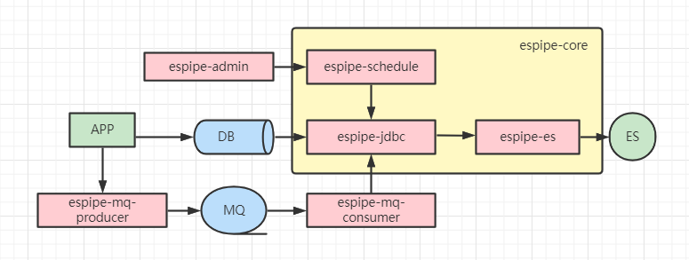
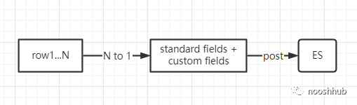

### design





- case 1: aggregate fields to one field was failed, since sql field has length limit
```
error: ORA-01489: result of string concatenation is too long
```
- case 2: elasticsearch total fields has size limit
```
co.elastic.clients.elasticsearch._types.ElasticsearchException: 
[es/index] failed: [illegal_argument_exception] Limit of total fields [1000] has been exceeded
```                      
based on this [discussion](https://discuss.elastic.co/t/approaches-to-deal-with-limit-of-total-fields-1000-in-index-has-been-exceeded/241039) we 
provide a flag custom_in_one
```yaml
espipe:
  elasticsearch:
    # fields_mode: flatten, all_in_one, custom_in_one
    fields_mode: custom_in_one
``` 
to use one field for all custom fields, let's call it custom_fields.

- case 3: data is missing by no reason while using logstash jdbc     
we will log the error
- case 4: speed
currently 100k could be synced in 15s, I believe we could make this much faster since load 100k data from a database only takes 4s.

**ESPIPE is query-based ETL, we may support log-based ETL in the future.**

The sql and index settings are under espipe directory, you can custmized it as your lie.
``` 
espipe
--h2 [database]  
----es
--------nhproject [index name]  
------------sql 
----------------init.sql 
----------------sync.sql 
----------------delete.sql  
----------------extension.sql [optinal, if there is an extension table for custom fields]  
----------------sql.properties [set primary id column name, and extension columns' name]  
------------mapping.json [index mapping]  
------------settings.json [index settings]  
```
